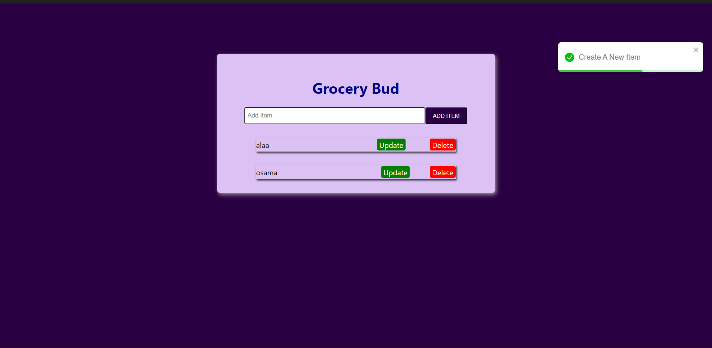

# Project Title

A  Task for Add item and Delete it.

## Table of Contents

- [Project Overview](#project-overview)
- [Features](#features)
- [Technologies Used](#technologies-used)
- [Screenshot](#screenshot)

## Project Overview

Task that show you how can add or delete or update item using react.

## Features

- Feature 1: Add item.
- Feature 2: Delete item.
- Feature 3: Update item.

## Technologies Used

- React: For building the user interface.
- Bootstrap: For styling the UI.

## Screenshot 

